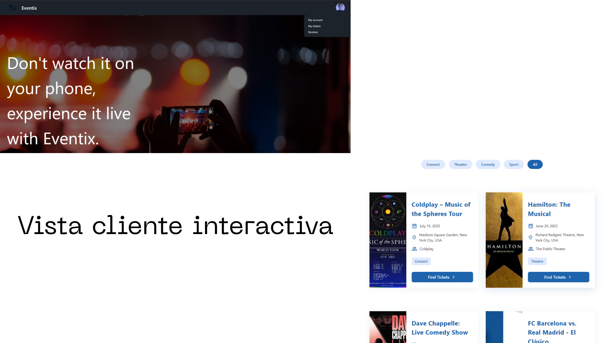
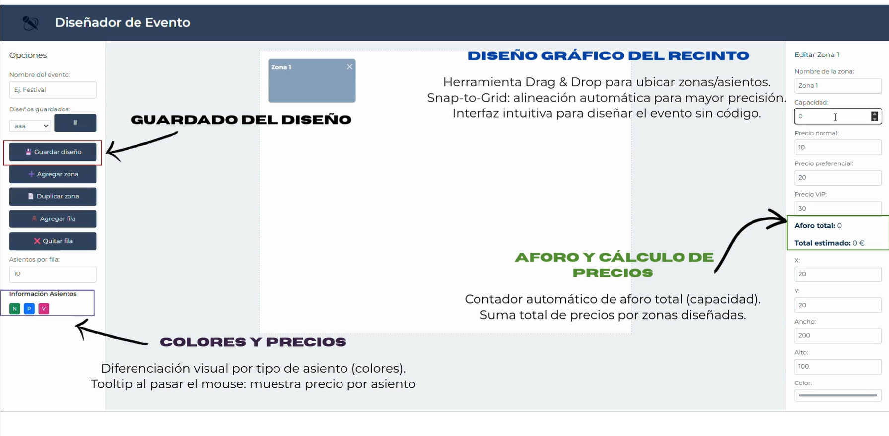
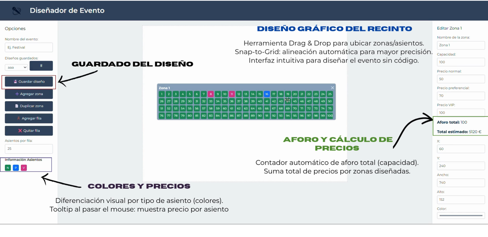
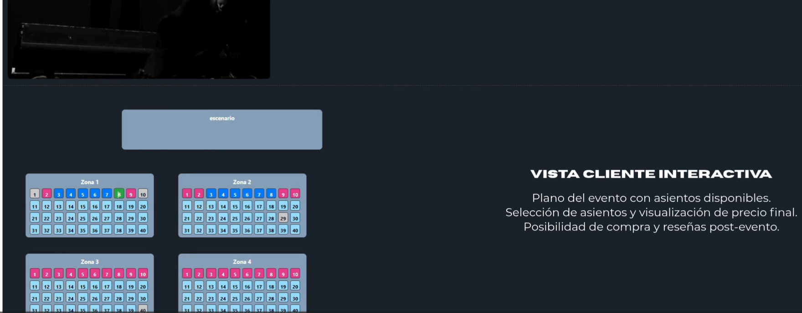
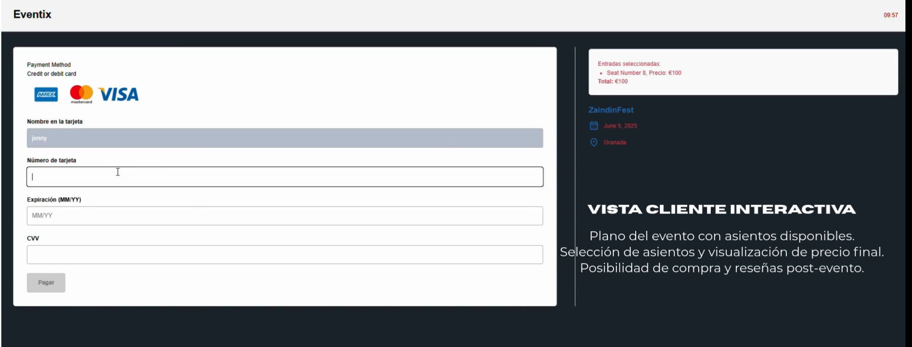
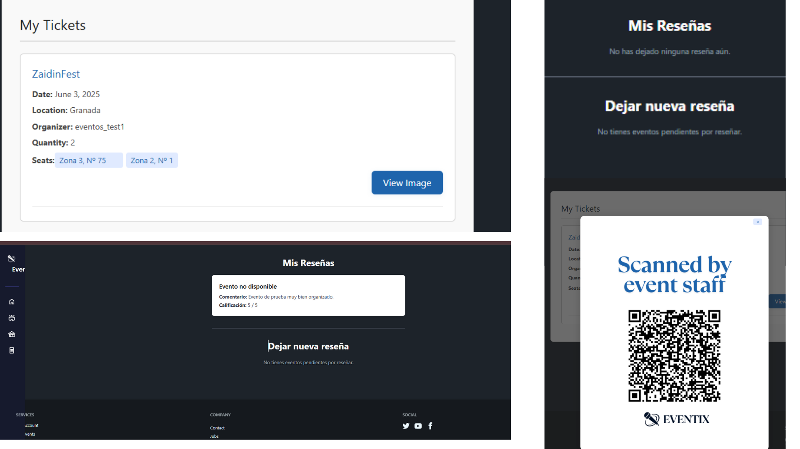
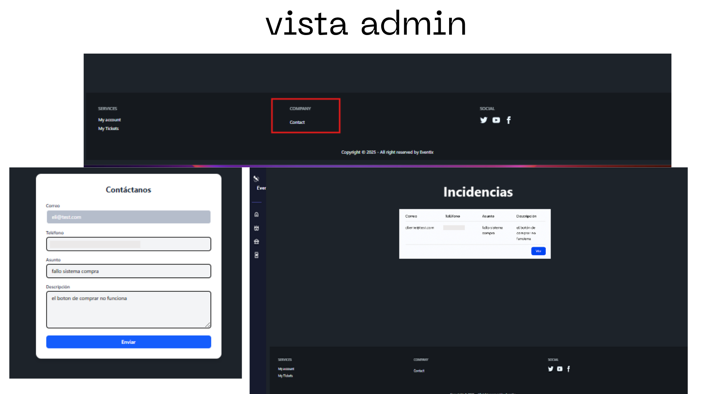

# Enventix

**Enventix** es una plataforma web desarrollada para la **gestión visual de eventos y venta de entradas** mediante un sistema interactivo basado en mapas. Su objetivo principal es **mejorar la experiencia** tanto de los organizadores como de los asistentes en la planificación, diseño y asistencia a eventos.

---

## ¿Por qué Enventix?

Existen muchas plataformas de venta de entradas, pero **pocas permiten al organizador diseñar visualmente su evento**, definir zonas, precios y aforos de forma personalizada.  
Además, muchas de las plataformas actuales han sido criticadas por falta de transparencia y prácticas abusivas.

> **Enventix nace como una alternativa libre, visual y segura.**

---

## Objetivos del Proyecto

- Desarrollar una **aplicación web funcional** para la gestión de eventos y venta de entradas.
- Implementar un sistema de **control por roles**: Super Admin, Gestor de Eventos, Usuario Final.
- Diseñar una interfaz visual **Drag & Drop** para crear mapas de eventos.
- Permitir a los organizadores **gestionar eventos y zonas** de forma eficiente.
- Facilitar a los usuarios la **compra de entradas** a través de un mapa interactivo.

---

## Roles de Usuario

| Rol              | Funcionalidad                                                                 |
|------------------|--------------------------------------------------------------------------------|
| **Super Admin**      | Control total del sistema, validación de usuarios y eventos                   |
| **Gestor de Eventos**| Creación y diseño de eventos, definición de zonas, aforos y precios           |
| **Usuario Final**    | Visualización de eventos, selección de asientos y compra de entradas          |

---

## Tecnologías Utilizadas

| Área                 | Tecnologías                            | Descripción                                                  |
|----------------------|-----------------------------------------|--------------------------------------------------------------|
| **Frontend**         | Angular, TypeScript, HTML, SCSS         | Creación de vistas, componentes reutilizables y estilos personalizados |
| **Angular CDK**      | Drag & Drop, Snap to Grid               | Diseño visual de recintos con alineación automática          |
| **Backend**          | Laravel (PHP)                           | API REST, lógica de negocio, autenticación y gestión de roles |
| **Autenticación**    | JWT (JSON Web Tokens)                   | Seguridad mediante emisión y validación de tokens            |
| **Base de Datos**    | MongoDB (con Compass)                   | Almacenamiento flexible de datos no estructurados            |
| **Control de Versiones** | GitHub                              | Repositorio colaborativo con gestión de ramas                |
| **Contenedorización**| Docker                                  | Entorno replicable y fácil despliegue del sistema            |

---

## Funcionalidades Clave

### 1. Diseño de Eventos (Drag & Drop)
- Interfaz visual para crear recintos personalizados  
- Zonas editables con colores, precios y aforos  
- Alineación automática (*snap to grid*) para mantener el orden

### 2. Gestión de Usuarios
- Sistema de roles (Super Admin, Gestor, Usuario)  
- Login, registro y control de acceso con JWT  
- Gestión segura de sesiones y permisos

### 3. Listado de Eventos
- Vista pública con eventos disponibles  
- Filtros por fecha, ubicación y categoría  
- Acceso al detalle del evento

### 4. Visualización del Evento
- Mapa interactivo con zonas visibles  
- Consulta de precios y disponibilidad en tiempo real  
- Experiencia clara y visual para el usuario final

### 5. Compra de Entradas
- Selección de asiento/zona con confirmación visual  
- Generación de entrada digital  
- Posibilidad de dejar reseñas post-evento

---

## Flujo de Usuario

### 👨‍💼 **Gestor de Eventos**
1. Inicia sesión → accede a su panel  
2. Crea un evento → diseña el recinto  
3. Define zonas, aforos y precios → publica  
4. Supervisa ventas y entradas

### 🙋‍♀️ **Usuario Final**
1. Ve el listado de eventos  
2. Selecciona uno → visualiza el mapa  
3. Escoge asiento → paga → recibe su entrada

### 🛡️ **Super Admin**
1. Valida organizadores  
2. Supervisa eventos y actividad global  
3. Gestiona incidencias del sistema

---

## Distribución del Trabajo

- **Frontend (Angular)**: desarrollo de vistas, diseño de interfaz, drag & drop  
- **Backend (Laravel)**: controladores, rutas, lógica de negocio  
- **Base de Datos (MongoDB)**: modelo de datos flexible  
- **Autenticación (JWT)**: sistema de login y control de roles  
- **Integración**: conexión de frontend y backend con validaciones y endpoints  
- **Diseño del Plano**: componente visual del recinto  
- **Presentación y documentación**: manuales y soporte para evaluación final

---
## Interfaz de la Plataforma

## 🎥 Demo en video

[Haz clic aquí para ver la demo de Enventix](./media/Eventix.mp4)

---
### Vista 1 – Panel de eventos

### Vista 2 – Plano del evento

### Vista 3 – Compra de entradas

### Vista 4 - Admin

## Aprendizajes y Retos

- Adaptación a nuevas tecnologías (Angular, Laravel, MongoDB, Docker)  
- Integración completa entre frontend y backend  
- Trabajo en equipo bajo presión  
- Fortalecimiento de habilidades técnicas y blandas:  
  comunicación, resiliencia, organización y resolución de problemas

---

## 🎓 Agradecimientos

A nuestros tutores y profesores por su guía y enseñanzas.  
A todas las personas que apoyaron directa o indirectamente este proyecto.

---
Proyecto desarrollado en **IES Zaidín Vergeles**

👩‍💻 Desarrollado por:  
- **Rocío C .C**  
- **Jenny P. V.C**
